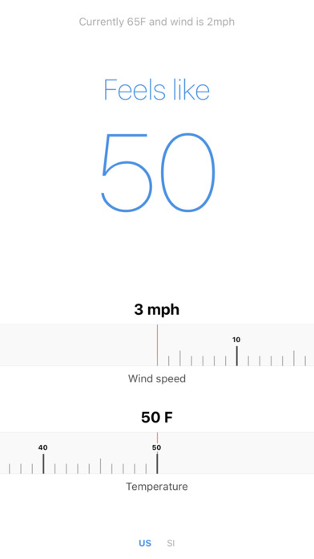

# Windchill

[Available on the App Store](https://appsto.re/us/wtyegb.i)

## Features

* Dead simple design
* Supports US and SI
* Selects unit system automatically based on locale
* Shows the current conditions
* Tap current conditions to set calculator to those values

## Neat tricks

* Use `babel-plugin-transform-inline-environment-variables` to inline `process.env.VAR`. Super useful for enabling features at build time.
* Add support for environment variables in `.env` by adding `[[ -s "../.env" ]] && source "../.env"` to Build Phases > Bundle React Native code and images in Xcode

## App Store Release

* Update changelog readme
* npm version VERSION
* Archive and upload
* git push && git push --tags

## Changelog

### 1.5.0

* Fix clipping related to font size preferences

### 1.4.0

* UI Tweaks
* Support for iPhone X
* Add App Store review prompt

### 1.3.0

* Refreshed UI and app icon
* Change ad-supported

### 1.2.0

* Attempt to calculate windchill with out of bounds temperature instead of showing error
* Fix gauge not animating to correct value when toggling between units
* Allow gauge to be scrolled to out of bounds values
* Save unit system preferences but default to current locale

### 1.1.2

* Adjust current conditions contrast

### 1.1.1

* Fix large text centering
* Fix error when calculated windchill was zero

### 1.1.0

* Fix 3-digit numbers wrapping
* Adjust layout for small and large screens
* Increase max speed
* Increase temperature range (-50 from 0)
* Set units to device locale automatically
* Add support for tapping conditions to set values

### 1.0.0

* Initial release

## Copyright

2016 Nic Haynes
